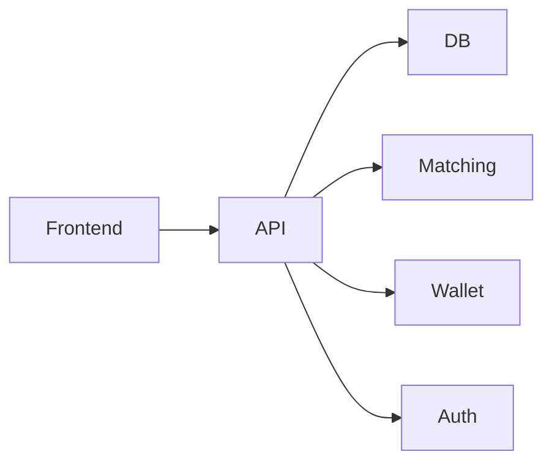

# Exchange App Architecture

Article [Trading Exchange: The building blocks](https://dejanualex.medium.com/trading-exchange-736161968260)

**Components:**
- Frontend: UI (React/Vue/HTML)
- REST API: Handles HTTP requests, routes, and business logic.
- Database: Stores users, balances, orders, and trades. 
- Order Matching Engine: Matches buy/sell orders.
- Wallet Management: Updates user balances.
- Authentication: Manages user sessions and security.

## Important design points

* Order book: The order book’s data structure directly affects matching speed, scalability, and correctness. (heap or balanced binary search tree)
* Matching engine: Drives the core logic for proccessing trades.

## Trading session

* Create an order book
* Add orders (bids and asks)
* Send new incoming orders
* Print the trades and order book

## Scenarios/Test cases: Example Order Sequences and Expected Outcomes

### Full match with exact quantity
**Orders placed:**
1. Limit buy order: 100 shares @ $50
2. Limit sell order: 100 shares @ $50

**Expected outcome:** Trade executes for 100 shares @ $50. Both orders fully filled. Order book empty.

### Partial fill - incoming order larger
**Orders placed:**
1. Limit sell order: 50 shares @ $45
2. Limit buy order: 100 shares @ $45

**Expected outcome:** Trade executes for 50 shares @ $45. Buy order partially filled (50/100). Remaining 50 shares buy order stays in book at $45.

### Partial fill - resting order larger
**Orders placed:**
1. Limit buy order: 100 shares @ $48
2. Limit sell order: 50 shares @ $48

**Expected outcome:** Trade executes for 50 shares @ $48. Sell order fully filled. Buy order partially filled (50/100). Remaining 50 shares buy order stays in book at $48.

### FIFO priority at same price level
**Orders placed:**
1. Limit buy order: 50 shares @ $50 (Bid A)
2. Limit buy order: 50 shares @ $50 (Bid B)
3. Limit sell order: 75 shares @ $50

**Expected outcome:** Bid A matches first (50 shares), then Bid B matches (25/50 shares). Bid B has 25 shares remaining in book.

### Best price priority
**Orders placed:**
1. Limit buy order: 100 shares @ $49
2. Limit buy order: 100 shares @ $50
3. Limit sell order: 150 shares @ $49

**Expected outcome:** Highest buy price ($50) matches first (100 shares), then next best buy price ($49) matches (50/100 shares). 50 shares sell order remains.

### Market order sweeping the book
**Orders placed:**
1. Limit sell order: 40 shares @ $51
2. Limit sell order: 60 shares @ $52
3. Market buy order: 100 shares

**Expected outcome:** Market buy sweeps through all sells. Executes 40 @ $51 and 60 @ $52. Order book empty.

### Market order with no liquidity
**Orders placed:**
1. Market buy order: 100 shares

**Expected outcome:** Market order remains unfilled. No trades execute. Order book empty.

### Invalid order side
**Orders placed:**
1. Order with invalid side parameter

**Expected outcome:** Order rejected with error message. No trade executes. Order book unchanged.