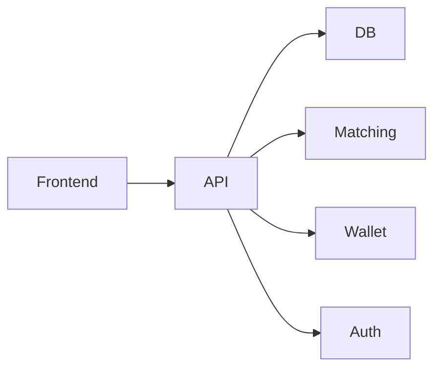

# Exchange App Architecture

**Components:**
- Frontend: UI (React/Vue/HTML)
- REST API: Handles HTTP requests, routes, and business logic.
- Database: Stores users, balances, orders, and trades. 
- Order Matching Engine: Matches buy/sell orders.
- Wallet Management: Updates user balances.
- Authentication: Manages user sessions and security.

## Important desgin points

* Order book: The order book’s data structure directly affects matching speed, scalability, and correctness. (heap or balanced binary search tree)
* Matching engine: Drives the core logic for proccessing trades.

## Trading session

* Create an order book
* Add orders (bids and asks)
* Send new incoming orders
* Print the trades and order book